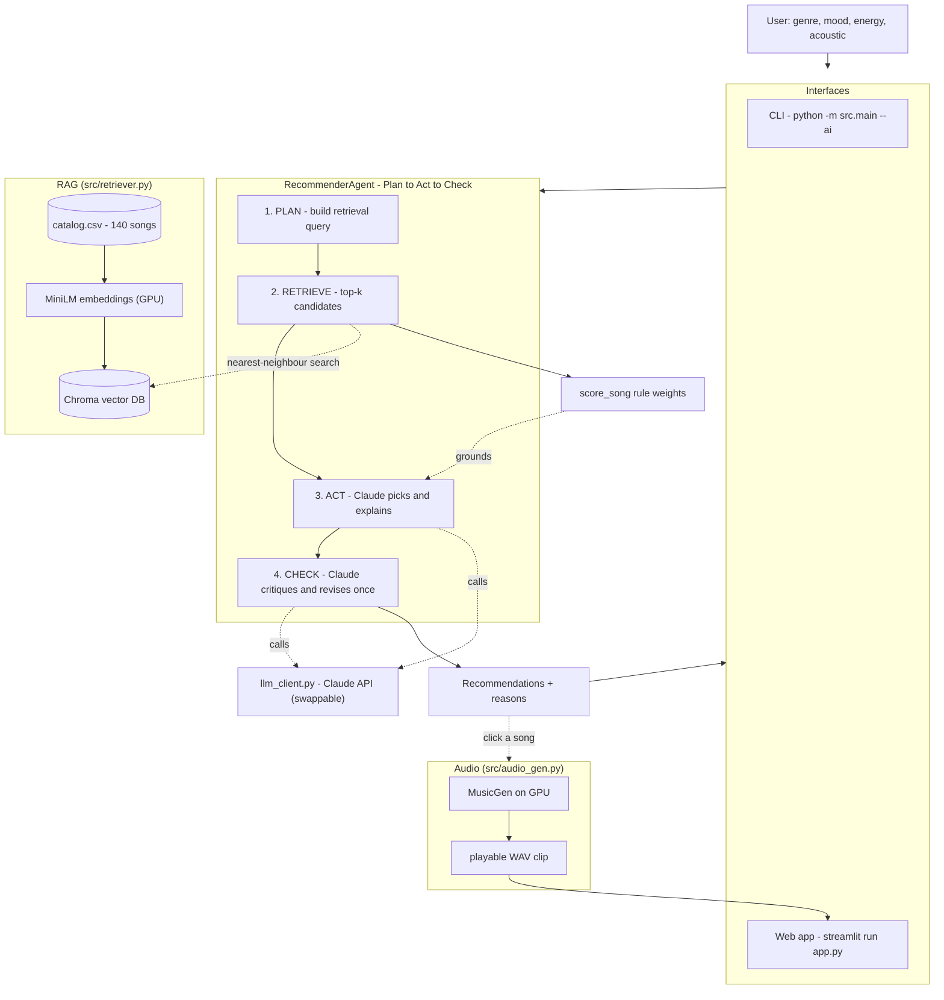

# 🎵 Music Recommender Simulation

## Project Summary

In this project you will build and explain a small music recommender system.

Your goal is to:

- Represent songs and a user "taste profile" as data
- Design a scoring rule that turns that data into recommendations
- Evaluate what your system gets right and wrong
- Reflect on how this mirrors real world AI recommenders

**My version (VibeCheck)** started as that rule-based CLI and now has a full AI layer on top. You give it a taste profile and it uses **RAG** to retrieve the most relevant songs from a 140-song catalog, an **agent loop** where **Claude** picks and explains the best ones (and double-checks its own answer), and it can even **generate an original audio clip** for any pick — locally on the GPU. It runs both as a CLI and as a **Streamlit web app**. Full details in the [AI Upgrade](#-ai-upgrade-final-project) section below.

---

## How The System Works

Real-world recommenders (Spotify, YouTube, etc.) learn what you like from your
behavior — the songs you play, like, skip, and save — and predict new songs with
similar features or that people with similar taste enjoyed. My version is simpler:
instead of learning from behavior, it uses a stated taste profile and scores each
song by how well its features match that profile. It prioritizes **genre and mood**
(the biggest matches) and then **energy** and **acoustic** preference for finer tuning.

**Features my `Song` object uses:** `genre`, `mood`, `energy`, `acousticness`.

**Features my `UserProfile` stores:** `favorite_genre`, `favorite_mood`,
`target_energy`, `likes_acoustic`.

### Algorithm Recipe

For every song, start `score = 0`, apply each rule, then rank.

- **Genre** — if `song.genre == user.favorite_genre`, add **+5**. Reason: "matches your favorite genre."
- **Mood** — if `song.mood == user.favorite_mood`, add **+4**. Reason: "matches your mood."
- **Energy** — add `2 × (1 − |song.energy − user.target_energy|)`. Perfect match adds ~2, far-off adds ~0. Reason: "energy is close to what you wanted."
- **Acoustic** — if `user.likes_acoustic` and `song.acousticness > 0.6`, add **+1**. Reason: "you like acoustic songs."

**Total** = sum of the rules. Sort descending, recommend the top `k`.

### Expected Bias

Because a genre match (+5) outscores a mood match (+4), this system **over-prioritizes genre** — it can bury a song that perfectly matches the user's mood just because it's in a different genre. It also assumes a stated profile is honest and stable, and only knows four features, so it ignores lyrics, artist, and anything about *why* someone likes a song.

---

## 🤖 AI Upgrade (Final Project)

The original recommender was a rule-based CLI over 20 songs. The final project adds a real AI layer while **reusing** the original scoring rules. It covers **three** of the required features at once — **RAG**, an **Agentic Workflow**, and **Reliability/Testing** — plus two stretch pieces: a **web app** and **local AI audio generation**.

### Architecture



*(Source: [`diagrams/architecture.mmd`](diagrams/architecture.mmd).)*

### What each piece does

| Feature | File | What it does |
|---|---|---|
| **RAG retrieval** | `src/retriever.py` | Describes each of the **140** songs in words, embeds them with a local MiniLM model (on GPU), stores them in a **Chroma** vector DB, and retrieves the best matches for a taste profile. |
| **Agentic workflow** | `src/agent.py` | A **Plan → Act → Check** loop: plan a query, retrieve grounded candidates, let **Claude pick + explain**, then Claude **critiques its own list and revises once**. |
| **Reliability** | `tests/`, `src/experiment.py` | Only real catalog songs (no hallucinations), no duplicates, deterministic, grounded explanations. `pytest` = 20 passing; `experiment.py` prints a reliability report. |
| **LLM brain** | `src/llm_client.py` | A swappable wrapper over the **Claude API** (defaults to cheap Haiku 4.5; provider changes in one place). |
| **Audio generation** | `src/audio_gen.py` | Turns a pick's vibe into a **MusicGen** prompt and generates an original 4–30s instrumental **locally on the GPU**. |
| **Web app** | `app.py` | A **Streamlit** UI: taste form → AI recommendations + reasons → a button to generate and play a clip. |

> **About the audio:** the 140-song catalog is *simulated* (fictional titles + feature numbers), so there are no real recordings. The audio feature **generates brand-new music** that matches a pick's vibe — it does not play the catalog song.

### The three required features, mapped

- ✅ **RAG** — embeddings + Chroma retrieval grounds every recommendation in real catalog data.
- ✅ **Agentic Workflow** — the Plan → Act → Check → Revise loop, where the AI checks its own output.
- ✅ **Reliability/Testing** — hallucination guards, determinism, and a full test + report suite.

---

## Getting Started

### Setup

1. **Create a virtual environment and install dependencies:**

   ```bash
   python -m venv .venv
   .venv\Scripts\activate            # Windows (Mac/Linux: source .venv/bin/activate)
   pip install -r requirements.txt
   ```

   For **GPU** audio + embeddings, install the CUDA build of PyTorch instead of the default:

   ```bash
   pip install torch --index-url https://download.pytorch.org/whl/cu124
   ```

2. **Add your Claude API key.** Copy `.env.example` to `.env` and paste your key:

   ```
   ANTHROPIC_API_KEY=sk-ant-...
   ```

3. **Build the expanded catalog** (once) — generates `data/catalog.csv` (140 songs):

   ```bash
   python data/build_catalog.py
   ```

### Running it

```bash
# Rule-based CLI over the original 20 songs (offline, no key needed)
python -m src.main

# AI version: RAG + Claude agent over the 140-song catalog
python -m src.main --ai

# The web app: recommend + explain + generate audio, in your browser
streamlit run app.py

# One agentic run with the full Plan -> Act -> Check trace
python -m src.agent

# Reliability: weight experiments + reliability report
python -m src.experiment
```

### Running Tests

Run the starter tests with:

```bash
pytest
```

You can add more tests in `tests/test_recommender.py`.

---

## Sample Recommendation Output

When you run `python -m src.main` it goes through 5 profiles and prints the top 5
for each one. Here is the first profile, the High-Energy Pop listener
(`genre=pop, mood=happy, energy=0.9`):

```
Loading songs from data/songs.csv...
Loaded 20 songs.

============================================================
PROFILE: High-Energy Pop
  genre=pop, mood=happy, energy=0.9, acoustic=False
============================================================
1. Sunrise City - Neon Echo
   Score:   10.84
   Reasons: genre match (+5.0), mood match (+4.0), energy match (+1.84)
2. Gym Hero - Max Pulse
   Score:   6.94
   Reasons: genre match (+5.0), energy match (+1.94)
3. Rooftop Lights - Indigo Parade
   Score:   5.72
   Reasons: mood match (+4.0), energy match (+1.72)
4. Island Time - Palm Fever
   Score:   5.36
   Reasons: mood match (+4.0), energy match (+1.36)
5. Storm Runner - Voltline
   Score:   1.98
   Reasons: energy match (+1.98)
```

Sunrise City wins because it's the only song that hits all three things at once:
it's pop, it's happy, and its energy is close to what I asked for. Every pick
also shows its reasons and points so you can see why it got chosen. The other 4
profiles and the full breakdown are in the model card.

**Screenshot or video** *(optional)*: <!-- Insert a screenshot or demo video link here -->

---

## Experiments You Tried

I put all the point values in one spot (`DEFAULT_WEIGHTS` in
`src/recommender.py`), so running an experiment is just changing the weights.
`src/experiment.py` re-runs the Happy Pop profile (`pop / happy / energy 0.9`)
with three different setups. You can run it with `python -m src.experiment`.

**Experiment 1: double the energy weight (2 to 4) and cut the genre weight in
half (5 to 2.5).**

| Rank | Baseline | After the change |
|------|----------|------------------|
| 1 | Sunrise City | Sunrise City |
| 2 | Gym Hero | Rooftop Lights |
| 3 | Rooftop Lights | Island Time |
| 4 | Island Time | Gym Hero |
| 5 | Storm Runner | Storm Runner |

This made it more accurate, not just different. When genre matters less, Gym Hero
(which is pop but its mood is intense) drops from #2 to #4. The songs that are
actually happy, Rooftop Lights and Island Time, move up. For someone who asked
for happy pop, that is better. It showed me the baseline was leaning on genre too
much.

**Experiment 2: turn off the mood rule (set its weight to 0).**

Now Gym Hero jumps to #1, ahead of the happy Sunrise City. This one made it worse.
Gym Hero is a pop workout song that is intense, not happy. So it proved the mood
rule was actually doing real work. Without it, genre and energy alone hand a
"happy pop" person an intense song.

**What I learned:** the results change a lot depending on how I balance genre vs
mood. Turning genre down helped. Taking mood out hurt.

---

## Limitations and Risks

- It only has 20 songs, so it runs out of good options fast.
- Most genres only have one song, so you get no variety in your favorite genre.
- It doesn't understand lyrics, artists, or why someone likes a song.
- It leans toward loud music, so people who want calm music get worse matches.
- It never says "I found nothing", even when nothing really fits.

I go deeper on all of this in the model card.

---

## Reflection

[**Model Card**](model_card.md)

Working on this showed me that a recommender is really just turning data into
numbers and then sorting. My system takes what you say you like, gives each song
points for how well it matches, adds the points up, and shows you the top ones.
That's it, there's no magic. The biggest thing that clicked for me was that the
recommendations are only as good as the data. Most of the problems I found were
not from my code, they were from the tiny 20-song list. When a whole genre only
has one song, there is nothing my rules can do to give you variety.

I also saw where bias sneaks in. My scoring gives genre more points than mood, so
a pop song can win even when the mood is wrong, like an intense workout song
showing up for someone who wanted happy music. And because most of the songs are
high energy, people who want calm music get worse matches, which is not really
fair to them. Using AI tools helped me write the code faster and explained things
I didn't get, like the difference between `.sort()` and `sorted()`. But I still
had to check its work. One time it changed an import and broke the run button, so
I learned not to just trust the output. The thing that surprised me most is how a
simple points system can still feel smart when it hands you a good song with the
reasons. If I kept going, I'd add way more songs first, then let it learn from
likes and skips instead of using one fixed profile.

---

## Final Project — What I Built

I added an AI layer to the original rule-based recommender (see [AI Upgrade](#-ai-upgrade-final-project) above for the full breakdown). Quick recap of the decisions and outcome:

- **Delivered:** a Streamlit **web app** + CLI, powered by **RAG** (Chroma + MiniLM over 140 songs), an **agentic** Plan → Act → Check recommender using **Claude**, a **reliability** test suite, and **local AI audio generation** with MusicGen on the GPU.
- **Required features covered:** RAG + Agentic Workflow + Reliability/Testing — three of the four (fine-tuning was intentionally skipped; prompting reaches the same result for far less effort/cost).
- **LLM:** Claude API behind a swappable `src/llm_client.py` (defaults to cheap Haiku 4.5).
- **Cost:** a few cents total — everything except the Claude calls runs free and locally.
- **New files:** `src/llm_client.py`, `src/retriever.py`, `src/agent.py`, `src/audio_gen.py`, `app.py`, `data/build_catalog.py`, `tests/test_reliability.py`, and `diagrams/architecture.mmd`.

### How it was built
Built incrementally with an AI coding agent (Claude Code) across 7 tested phases — LLM client → RAG → agent → reliability → audio → web app → docs — committing and running smoke tests at each checkpoint. See [`ai_interactions.md`](ai_interactions.md) for that write-up.

